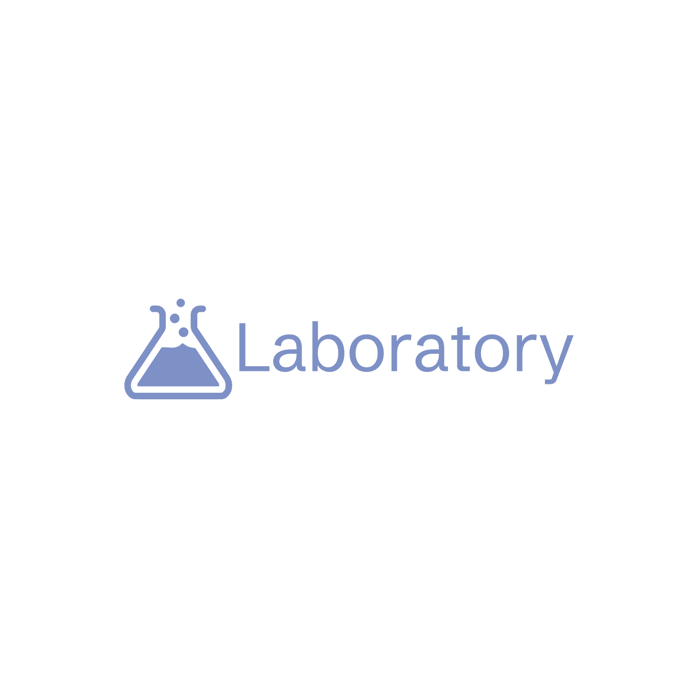

# LABORATORY

## A complete educational platform

### Features of Laboratory
- You can make posts related to science.
- You can like posts and answers.
- We have tools related to science ,which can solve your daily life science problem.
- You can post questions.
- You can search for videos.
- You can search for answers.
- You can find accurate mean,mode and median answers from just image.
  
  1.Gravitational force calculator
  
  2.Atomic mass getter
  
  3.Chemical formulae creator
  
  4.Find Metal or not

  5.You can post qustions and get answers.

  6.You can give answers.

- This platform solves issues programmatically not on the basis of opinions of others.
  
#### Structure
``` js
/cors                         // Cors configuration
|
/Errors                       // Custom errors
|
/GETAPI                       // All APIs to get data
|
/JSON                         // JSON files
|
/Middlewares                  // Middleware files
|
/Reusable                     // Reusable functions' files
|
/Handler                    
|   /deleteHandlers          // All functions related to DELETE method
|   /getHandlers          // All functions related to POST method
|   /postHandlers            // All functions related to rendering HTML pages
|
/static
|   /CSS                      // All CSS files
|   /Images                   // All images
|   /javascript               // All JS files(compiled)
|
/Statistics                   //All statistics files
|
/Structs                      // All structs' files
|
/templates                    // All HTML files
|
/TS                           // All typescript files
|
/.dockerignore
/.env
/.env.sample
/.gitignore
/Algorithm.txt
/Dockerfile
/go.mod
/go.sum
/main.go                      // Main file to start application
/package.json                  
/README.md                    // Project README
/tsconfig.json                //TS configurations     
```
    
##### Tools used in it
- It is built in `Go`,`javascript`,`HTML`,`CSS` .
- For type safety ,Typescript is used.
- Database : `MySQL`
- For containerization we use docker.
- You can find image of this project on dockerhub.

- Run `Docker` image :-
  
  `docker run -it parasdeveloper8/laboratory-paras`
  
__Just Start this project__

- You can do port mapping :-

  `docker run -it -p 2000:4900 parasdeveloper8/laboratory-paras`

  __Warning__ : If you use port except of 4900,then apis in frontend will fail to fetch data.
  
__creator__ : _paras prajapat_


